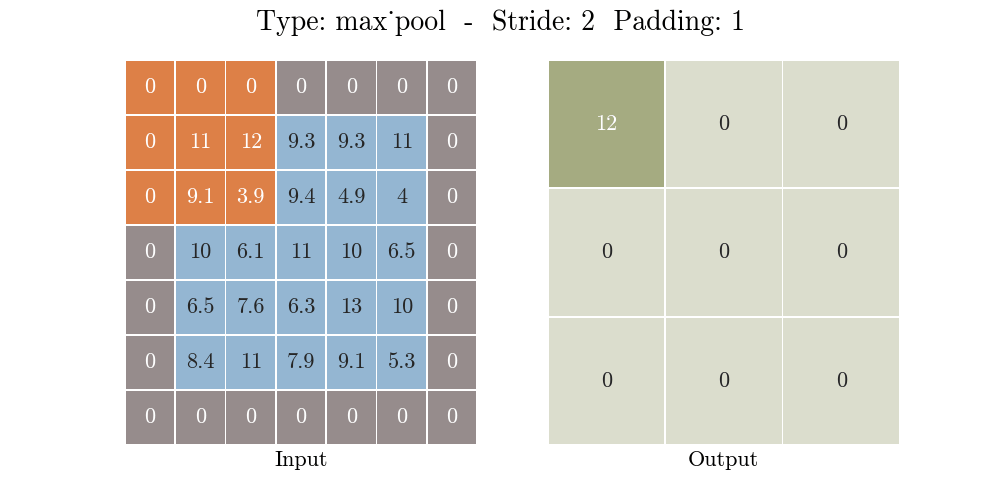
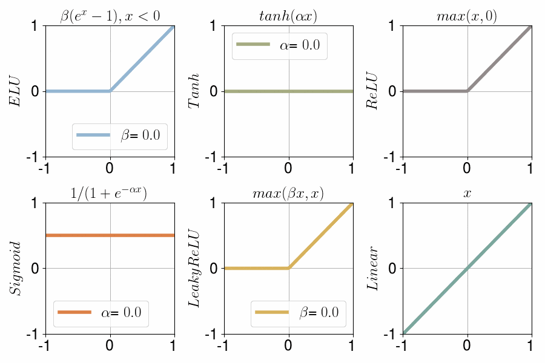
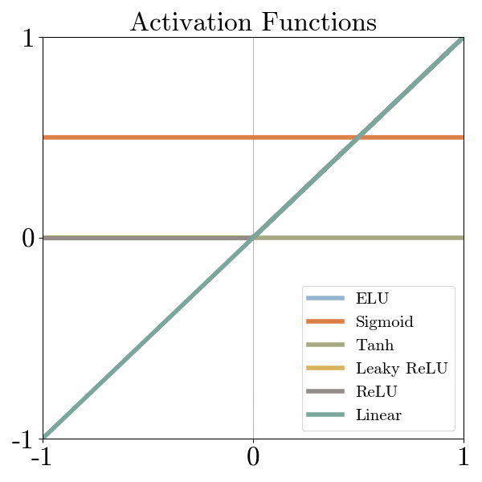
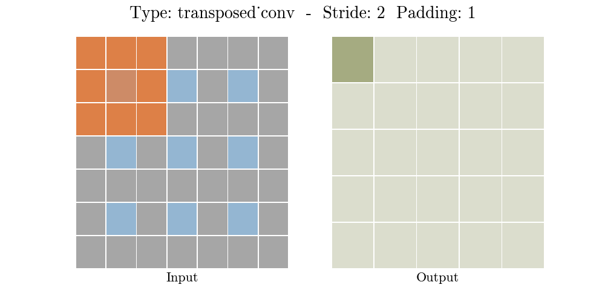

<h1 align="center">Autoencoder</h1>

<div align="center">
    
</div>

<br>

<div align="center">
    
    
    
</div>

<br>

## **1. Pengertian Autoencoder**

<div align="center">
    
</div>

<br>

Autoencoder adalah jenis jaringan saraf tiruan yang digunakan untuk mempelajari pengkodean efisien dari data tanpa label (unsuvervised learning). Autoencoder mempelajari dua fungsi: fungsi pengkodean (encoding) yang mengubah data input menjadi representasi terkode, dan fungsi dekoding (decoding) yang merekonstruksi data input dari representasi yang dikodekan. Autoencoder mempelajari representasi yang efisien (encoding) untuk sekumpulan data, biasanya untuk pengurangan dimensi.

Terdapat beberapa varian yang bertujuan memaksa representasi yang dipelajari untuk mengasumsikan sifat-sifat/properti yang berguna. Contohnya adalah regularized autoencoders (Sparse, Denoising and Contractive), yang efektif dalam mempelajari representasi untuk tugas klasifikasi lanjutan, dan [**Variational autoencoders**](https://en.wikipedia.org/wiki/Variational_autoencoder), dengan aplikasi seperti [**generative models**](https://en.wikipedia.org/wiki/Generative_model). Autoencoder diterapkan pada banyak permasalahan, termasuk [**facial recognition**](https://en.wikipedia.org/wiki/Face_recognition), feature detection, anomaly detection, dan memperoleh makna dari kata-kata. Autoencoder juga merupakan model generatif yang dapat secara acak menghasilkan data baru yang mirip dengan data input (data training).

Untuk mempelajari lebih lanjut tentang Autoencoder, silakan membaca bab 14 dari buku [**Deep Learning**](https://www.deeplearningbook.org/) karya Ian Goodfellow, Yoshua Bengio, dan Aaron Courville.

<br>

## **2. Implementasi Autoencoder**

Beberapa aplikasi Autoencoder diantaranya:

### **2.1. Deteksi Anomali**

Autoencoder sering digunakan untuk deteksi anomali. Autoencoder membuat pengkodean yang menangkap hubungan antar data. Jika kita melatih autoencoder pada dataset tertentu, parameter encoder dan decoder akan dilatih untuk merepresentasikan hubungan dalam dataset tersebut dengan baik. Oleh karena itu, autoencoder dapat merekonstruksi data dari dataset tersebut dengan kesalahan rekonstruksi yang kecil. Namun, jika data dari jenis yang berbeda dimasukkan ke dalam autoencoder, kesalahan rekonstruksi akan sangat besar. Dengan menetapkan batas kesalahan yang tepat, kita dapat membuat detektor anomali.

### **2.2. Menghilangkan Noise**

Autoencoder dapat digunakan untuk menghilangkan noise dari data. Jika kita memasukkan data noisy sebagai input dan data bersih sebagai output, dan melatih autoencoder pada pasangan data tersebut, autoencoder yang terlatih akan sangat berguna untuk menghilangkan noise. Hal ini karena titik-titik noise biasanya tidak memiliki korelasi. Karena autoencoder perlu merepresentasikan data dalam dimensi terendah, pengkodean biasanya hanya mencakup hubungan penting, mengabaikan yang acak seperti noise. Jadi, data yang didekodekan keluar sebagai output autoencoder bebas dari hubungan ekstra dan noise.

### **2.3. Model Generatif**

Sebelum adanya GAN (Generative Adversarial Networks), autoencoder digunakan sebagai model generatif. Salah satu pendekatan modifikasi autoencoder, yaitu variational autoencoders (VAE), digunakan untuk tujuan generatif.

### **3.4. Penyaringan Kolaboratif**

Penyaringan kolaboratif biasanya menggunakan metode faktorisasi matriks, tetapi autoencoder dapat mempelajari ketergantungan dan memprediksi matriks item-pengguna.

<br>

## **3. Arsitektur Autoencoder**

### **3.1. Encoder**

Jaringan encoder menerapkan blok konvolusi diikuti dengan downsampling (memperkecil dimensi) dengan maxpool. Jaringan encoder terdiri dari beberapa layer sebagai berikut.

#### **3.1.1. Convolution layer**

Merupakan proses konvolusi citra input dengan filter yang menghasilkan `feature map`.

<div align="center">
   
</div>
<br>
<div align="center">
   
   
</div>
<div align="center">
   
   
</div>
<br>

```python
tf.keras.layers.Conv2D(
   num_filters,
   kernel_size,
   strides, 
   padding
)
```

- num-filters → jumlah filter output dalam konvolusi → dimensi ruang output
- kernel_size → ukuran spasial dari filter (lebar/tinggi)
- stride → besar pergeseran filter dalam konvolusi
- padding → jumlah penambahan nol pada gambar
  - valid → tidak ada padding
  - same → padding nol merata kiri/kanan/atas/bawah

#### **3.1.2. Batch Normalization**

Berperan untuk mengurangi pergeseran kovarian atau menyamakan distribusi setiap nilai input yang selalau berubah karena perubahan pada layer sebelumnya selama proses training.

<div align="center">
   
</div>
<br>

```python
tf.keras.layers.BatchNormalization()
```

#### **3.1.3. Pooling Layer**

Berperan untuk memperkecil dimensi feature image (downsampling) dan menyimpan informasi penting.

<div align="center">
   
   
</div>
<br>

```python
tf.keras.layers.MaxPool2D(
   pool_size=(2, 2),
   strides=None,
   padding='valid',
)
```

- pool_size → ukuran pool
- strides → besar pergeseran
- padding → jumlah penambahan nol pada gambar
  - valid → tidak ada padding
  - same → padding nol merata kiri/kanan/atas/bawah

#### **3.1.4. Fungsi Aktivasi**

Merupakan fungsi yang digunakan pada jaringan saraf untuk mengaktifkan atau tidak mengaktifkan neuron. Karakteristik yang harus dimiliki oleh fungsi aktivasi jaringan backpropagation antara lain harus kontinyu, terdiferensialkan, dan tidak menurun secara monotonis (monotonically non-decreasing).

<div align="center">
   
   
</div>
<br>

```python
tf.keras.layers.Activation(activation)
```

- activation → fungsi aktivasi

Sebelum jaringan encoder, perlu melakukan input layer. Ukuran input sesuai dengan jumlah fitur pada data input.

```python
tf.keras.layers.InputLayer(input_shape=(height, width, color_channels))
```

- input_shape → input gambar

Dibawah ini merupakan blok encoder.

```python
def encoder_block(input, num_filters):
   x = tf.keras.layers.Conv2D(num_filters, 3, padding='same')(input)
   x = tf.keras.layers.BatchNormalization()(x)
   x = tf.keras.layers.Activation('relu')(x)

   x = tf.keras.layers.Conv2D(num_filters, 3, padding='same')(x)
   x = tf.keras.layers.BatchNormalization()(x)
   x = tf.keras.layers.Activation('relu')(x)

   p = tf.keras.layers.MaxPool2D(2, 2)(x)

   return x, p
```

### **3.2. Bridge/Bottleneck**

<div align="center">
   
</div>
<br>

Bridge/Bottleneck menghubungkan encoder dan jaringan decoder dan melengkapi aliran informasi. Dibawah ini merupakan contoh dari Bridge/Bottleneck.

```python
def conv_block(input, num_filters):
   x = tf.keras.layers.Conv2D(num_filters, 3, padding='same')(input)
   x = tf.keras.layers.layers.BatchNormalization()(x)
   x = tf.keras.layers.layers.Activation('relu')(x)

   return x
```

### **3.3. Decoder**

Jaringan Decoder berfungsi untuk secara semantik memproyeksikan fitu diskriminatif (resolusi lebih rendah) yang dipekajari oleh jaringan encoder ke ruang piksel (resolusi lebih tinggi) untuk mendapatkan klasifikasi yang padat. Jaringan Decoder terdiri dari beberapa layer sebagai berikut.

#### **3.3.1. Transpose Convolution Layer**

Conv2DTranspose berperan untuk upsampling (menambah dimensi) dan menerapkan blok konvolusi.

<div align="center">
   
</div>
<br>
<div align="center">
   
   
</div>
<div align="center">
   
   
</div>
<br>

   ```python
   tf.keras.layers.Conv2DTranspose(num_filters, kernel_size, strides, padding)
   ```

- num-filters → jumlah filter output dalam konvolusi → dimensi ruang output
- kernel_size → ukuran spasial dari filter (lebar/tinggi)
- stride → besar pergeseran filter dalam konvolusi
- padding → jumlah penambahan nol pada gambar
   - valid → tidak ada padding
   - same → padding nol merata kiri/kanan/atas/bawah

#### **3.3.2. Concatenate**

Berperan menggabungkan 2 array (tensor).

```python
tf.keras.layers.Concatenate()([skip_features, upconv])
```

- skip_features → koneksi jalan pintas yang memberikan informasi tambahan yang membantu dekoder menghasilkan fitur output yang lebih baik.
- upconv → berupa Conv2DTranspose

Dibawah ini merupakan blok decoder.

```python
def decoder_block(input, skip_features, num_filters):
   upconv = layers.Conv2DTranspose(num_filters, 3, strides=(2, 2), padding="same")(input)
   upconv = layers.BatchNormalization()(upconv)
   upconv = layers.Activation('relu')(upconv)

   c = layers.Concatenate()([skip_features, upconv])

   y = layers.Conv2D(num_filters, 3, padding='same')(c)
   y = layers.BatchNormalization()(y)
   y = layers.Activation('relu')(y)

   y = layers.Conv2D(num_filters, 3, padding='same')(y)
   y = layers.BatchNormalization()(y)
   y = layers.Activation('relu')(y)

   return y
```

### **3.4. Output**

<div align="center">
   
</div>

Output dari decoder terakhir melewati konvolusi 1x1 dengan aktivasi sigmoid. Fungsi aktivasi sigmoid mewakili klasifikasi berdasarkan piksel. Data yang kita miliki mempunyai rentang dari 0 sampai 1 (sudah ternomalisasi), activation function menggunakan sigmoid yang mempunyai rentang dari 0 sampai 1.

```python
tf.keras.layers.Conv2D(3, 1, activation='sigmoid', padding='same')
# channels RGB (3), kernel_size, activation, padding
```

<br>

## **4. Evaluasi Model Autoencoder**

Pada Autoencoder terdapat beberapa metrik yang dijadikan sebagai parameter dalam evaluasi sebuah model sebagai berikut.

### **4.1. PSNR (Peak Signal-to-Noise Ratio)**

PSNR merupakan parameter kinerja untuk mengetahui seberapa tinggi perbaikan kejernihan citra terhadap noise dalam dB.

```python
def psnr(pred, gt):
   return tf.image.psnr(pred, gt, max_val=1.0)
```

### **4.2. SSIM (Structural Similarity)**

SSIM merupakan parameter kinerja untuk mengetahui seberapa tinggi tingkat kemiripan struktur antara citra hasil perbikan dengan citra ground-truth.

```python
def ssim(pred, gt):
   return tf.image.ssim(pred, gt, max_val=1.0)
```

<br>

<h2 align="center">Keperluan Magang</h2>

- Code : [**Image Denoising**](https://colab.research.google.com/drive/1IJ5aqcjqalfQj9WFRevuVF9HRoDfOeQf?usp=sharing)
- Pengumpulan Magang : [**Form Pengumpulan**](https://forms.gle/W2RWe1XiZkkVvKSZ9)
